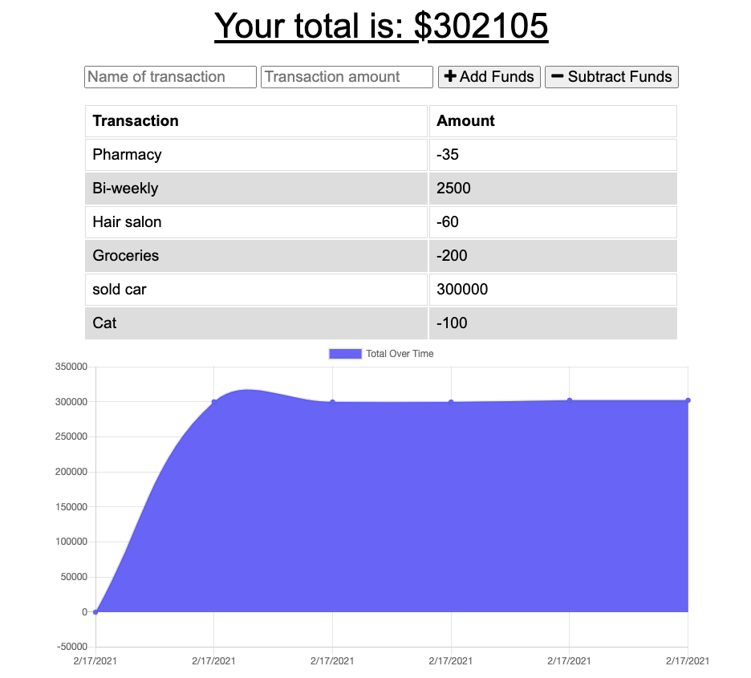

# budget-tracker

Budget Tracker is a progressive web application (PWA) that allows users to track their budgets by adding expenses and deposits to their budget, even when they are offline. 

# Example 

## Check the deployed version in Heroku 

